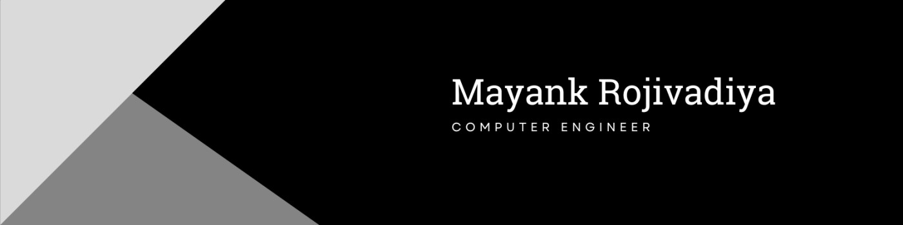

## Hi, I'm Mayank Rojivadiya 
I'm Mayank Rojivadiya, a passionate Computer Engineering student with a focus on Full Stack Development and Python.
🚀 Currently growing through hands-on experience, technical events, and leadership roles in NSS 
📚 Always eager to learn, collaborate, and contribute to meaningful tech solutions.

## 🎓 Education
📚 H.S.C from GSHSEB (2021 - 2022) - Performance : 67 % 
🧑‍🎓 Bachelor's Degree in Computer Engineering @ LDRP-ITR, Gandhinagar (2022 - 2026)

## 🛠 Technologies I Use  

## Socials
 &nbsp;
 &nbsp;
 &nbsp;
 &nbsp;